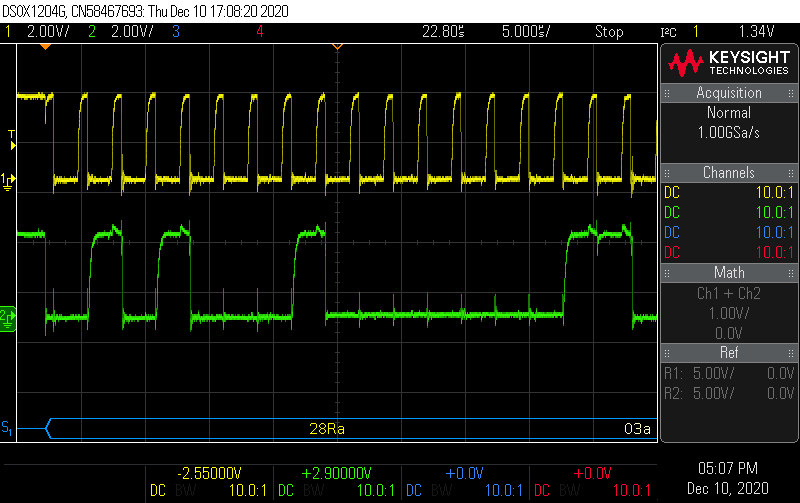

# L452-WeighingStation

## Board setup

---

## I2C interface board

The small interface board design is available on Open Source Hardware Lab

https://oshwlab.com/ciseli/i2c_dual_interface

---

## Signals

### 10k pull-ups

### 2k2 pull-ups

### 1k pull-ups

